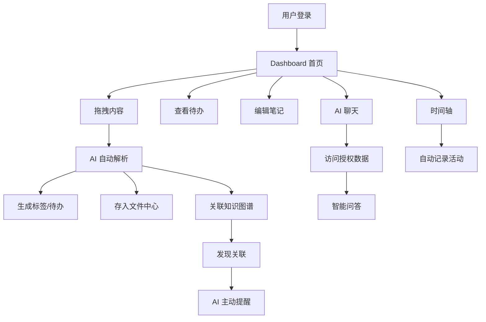

# Old Z（老周）产品需求文档（PRD）

## 1. 产品概述

Old Z（老周）是一款融合笔记、待办、文件管理、AI 助手与个人数字大脑的效率应用。核心理念是"用户只负责拖入内容，AI 负责理解、整理、关联、提醒"。面向学生、开发者、设计师、创业者、内容创作者及知识工作者，通过"全局拖拽系统"将任何内容快速转化为知识、任务或项目资产。

## 2. 核心功能

### 2.1 功能模块

1. **Dashboard 首页**：概览今日待办、最近文件、AI 提醒、活跃笔记
2. **全局拖拽系统**：支持文件、图片、PDF、网页链接、邮件等拖入，自动解析、分类、生成标签和待办
3. **文件中心**：统一管理所有文件，支持全文搜索、标签过滤、多格式预览
4. **待办管理**：可绑定文件、笔记、聊天、项目，支持优先级、截止日期、子任务
5. **笔记模块**：Markdown 编辑器、数据库嵌入、AI 补全、关联知识图谱
6. **知识图谱**：自动建立笔记、文件、待办之间的关联关系，可视化展示
7. **AI 聊天**：访问用户授权数据进行问答，支持上下文关联
8. **AI 数字分身**：基于导入的聊天记录建立智能体，仅作为历史风格参考
9. **AI 主动提醒**：监督目标、习惯与项目进度，主动推送提醒
10. **时间轴**：记录每日工作与成长，自动聚合各类活动

### 2.2 页面详情

| 页面名称 | 模块名称 | 功能描述 |
|----------|----------|----------|
| Dashboard | 今日概览 | 显示今日待办数量、最近文件、AI 摘要提醒 |
| Dashboard | 快速拖拽区 | 页面中央大面积拖拽热区，支持拖入任意内容 |
| Dashboard | 活跃笔记 | 最近编辑的笔记卡片列表 |
| 文件中心 | 文件列表 | 支持列表/网格视图切换，按类型/标签/日期筛选 |
| 文件中心 | 文件预览 | PDF、图片、文档在线预览 |
| 文件中心 | 全文搜索 | 基于 Elasticsearch 的全文检索 |
| 待办管理 | 待办列表 | 按项目/优先级/日期分组，支持拖拽排序 |
| 待办管理 | 待办详情 | 关联文件、笔记、子任务、截止日期 |
| 笔记模块 | 编辑器 | Markdown + 富文本混合编辑，AI 补全 |
| 笔记模块 | 数据库视图 | 表格、看板、日历等多视图展示 |
| 知识图谱 | 图谱可视化 | 力导向图展示实体关联关系 |
| AI 聊天 | 对话界面 | 多轮对话，支持引用文件和笔记 |
| AI 聊天 | 数字分身 | 选择智能体进行风格化对话 |
| 时间轴 | 日时间轴 | 按时间线展示每日活动记录 |
| 时间轴 | 周/月视图 | 聚合视图展示成长趋势 |

## 3. 核心流程

用户登录后进入 Dashboard 首页，可通过全局拖拽将文件、链接等内容拖入系统。系统自动解析内容，提取关键信息，生成标签和待办建议。用户可在文件中心管理所有文件，在待办模块追踪任务进度，在笔记模块进行深度记录。AI 助手持续分析用户数据，通过知识图谱发现关联，主动推送提醒和建议。

## 4. 用户界面设计

### 4.1 设计风格
- **主色调**：深墨绿 (#1a2e1a) + 暖金 (#d4a853) + 炭灰 (#2a2a2a)
- **辅助色**：柔和白 (#f5f0e8)、浅绿 (#3a5a3a)
- **按钮风格**：圆角矩形，微妙内阴影，hover 发光效果
- **字体**：标题用思源宋体 (Noto Serif SC)，正文用思源黑体 (Noto Sans SC)
- **布局风格**：左侧固定导航栏 + 右侧内容区，卡片式布局
- **图标风格**：线性图标 (Lucide)，配合微妙的动效
- **整体氛围**：沉稳、专业、温暖，如同老式书房与现代科技的融合

### 4.2 页面设计概览

| 页面名称 | 模块名称 | UI 元素 |
|----------|----------|---------|
| Dashboard | 拖拽热区 | 虚线边框圆角区域，拖入时脉冲发光动画 |
| Dashboard | 待办卡片 | 半透明毛玻璃卡片，左侧优先级色条 |
| 文件中心 | 文件网格 | 圆角缩略图卡片，hover 浮起 + 阴影 |
| 笔记模块 | 编辑器 | 暗色背景，绿色荧光语法高亮 |
| 知识图谱 | 图谱画布 | 深色背景，发光节点 + 流动连线动画 |
| AI 聊天 | 对话气泡 | 用户气泡暖金色，AI 气泡深绿色 |
| 时间轴 | 时间线 | 垂直中轴线，左右交替卡片布局 |

### 4.3 响应式设计
- 桌面优先设计，支持 1280px 及以上最佳体验
- 平板适配（768px-1280px）：侧边栏可折叠
- 移动端适配（<768px）：底部导航栏，单列布局
