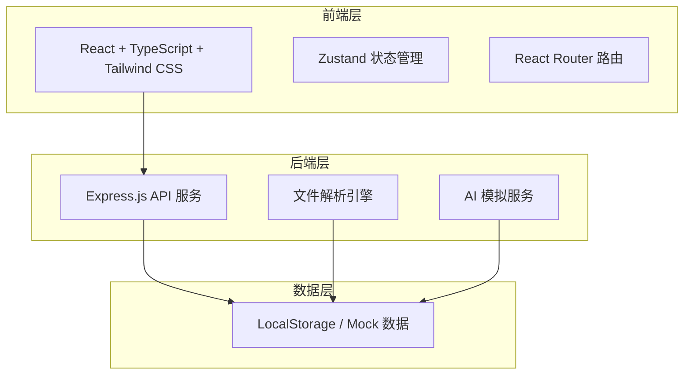
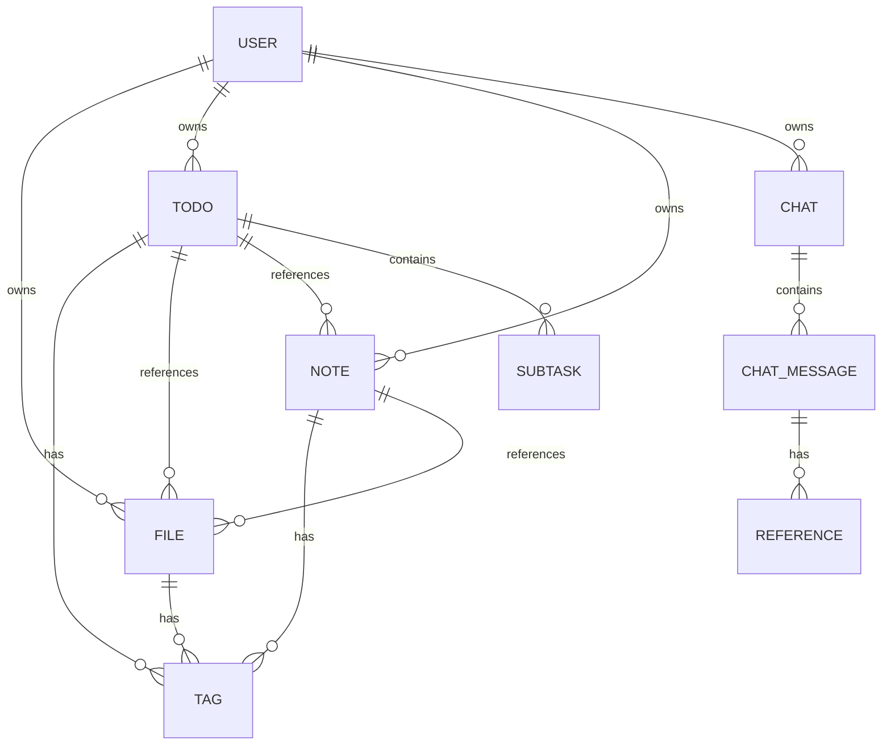

# Old Z 技术架构文档

## 1. 架构设计



## 2. 技术描述

- **前端**：React 18 + TypeScript + Tailwind CSS 3 + Vite
- **初始化工具**：vite-init
- **后端**：Express.js（轻量 API 服务）
- **数据库**：Mock 数据（前端 Zustand store + LocalStorage 持久化）
- **UI 组件**：Lucide React 图标库
- **状态管理**：Zustand
- **路由**：React Router DOM v6

## 3. 路由定义

| 路由 | 用途 |
|------|------|
| `/` | Dashboard 首页，概览 + 拖拽热区 |
| `/files` | 文件中心，文件管理与搜索 |
| `/todos` | 待办管理，任务列表与详情 |
| `/notes` | 笔记模块，Markdown 编辑器 |
| `/notes/:id` | 笔记详情/编辑页 |
| `/graph` | 知识图谱，可视化关联 |
| `/chat` | AI 聊天，对话界面 |
| `/timeline` | 时间轴，活动记录 |

## 4. API 定义

### 4.1 文件相关

```typescript
// 文件实体
interface FileItem {
  id: string;
  name: string;
  type: 'document' | 'image' | 'pdf' | 'link' | 'email' | 'other';
  size: number;
  tags: string[];
  content?: string;
  createdAt: string;
  updatedAt: string;
}

// 创建文件
POST /api/files
Body: FormData { file: File, tags?: string[] }
Response: { success: boolean; data: FileItem }

// 获取文件列表
GET /api/files?type=&tag=&search=
Response: { success: boolean; data: FileItem[] }
```

### 4.2 待办相关

```typescript
interface Todo {
  id: string;
  title: string;
  description?: string;
  priority: 'low' | 'medium' | 'high' | 'urgent';
  status: 'pending' | 'in_progress' | 'completed';
  dueDate?: string;
  tags: string[];
  fileIds: string[];
  noteIds: string[];
  subtasks: { id: string; title: string; done: boolean }[];
  createdAt: string;
}

POST /api/todos
GET /api/todos?status=&priority=
PATCH /api/todos/:id
DELETE /api/todos/:id
```

### 4.3 笔记相关

```typescript
interface Note {
  id: string;
  title: string;
  content: string; // Markdown 格式
  tags: string[];
  linkedFileIds: string[];
  linkedTodoIds: string[];
  createdAt: string;
  updatedAt: string;
}

POST /api/notes
GET /api/notes?tag=&search=
GET /api/notes/:id
PATCH /api/notes/:id
DELETE /api/notes/:id
```

### 4.4 AI 聊天相关

```typescript
interface ChatMessage {
  id: string;
  role: 'user' | 'assistant';
  content: string;
  timestamp: string;
  references?: { type: 'file' | 'note' | 'todo'; id: string }[];
}

POST /api/chat
Body: { message: string; conversationId?: string }
Response: { success: boolean; data: ChatMessage }
```

## 5. 数据模型

### 5.1 核心实体关系



### 5.2 知识图谱节点类型

- **文件节点**：FileItem
- **笔记节点**：Note
- **待办节点**：Todo
- **标签节点**：Tag
- **边**：基于引用关系、标签共现、内容相似度建立

## 6. 全局拖拽系统设计

拖拽系统是核心功能，技术实现如下：

1. **拖拽监听层**：全局 `dragover` + `drop` 事件监听
2. **内容识别层**：根据 MIME 类型和文件扩展名自动分类
3. **解析引擎层**：
   - 文本文件：直接读取内容
   - 图片：生成缩略图 + OCR 预留接口
   - PDF：提取文本摘要
   - 链接：抓取标题和摘要
4. **AI 处理层**：自动生成标签、分类建议、待办建议
5. **存储层**：写入 Zustand store，持久化到 LocalStorage
